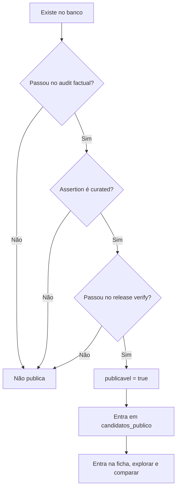

# Fluxo de Funcionamento do PuxaFicha

## Resumo

Este documento descreve **como o site funciona hoje**, de onde vêm as informações, para onde elas vão, qual é a hierarquia entre fontes e qual é a lógica que decide o que aparece ou não aparece no site.

Hoje o PuxaFicha opera em regime **fail-closed**:

- o banco pode ter `144` candidatos ativos
- mas o site só mostra quem está com `publicavel = true`
- se ninguém estiver `publicavel = true`, o site fica vazio por escolha de segurança, não por bug visual

## Fluxograma Geral

```mermaid
flowchart TD
    A[Fontes externas] --> A1[TSE]
    A --> A2[Câmara]
    A --> A3[Senado]
    A --> A4[Wikipedia/Wikidata]
    A --> A5[Imprensa sólida e fontes partidárias/oficiais]
    A --> A6[Google News como detector]

    A1 --> B[Scripts de ingestão e enriquecimento]
    A2 --> B
    A3 --> B
    A4 --> B
    A5 --> C[Curadoria factual manual]
    A6 --> C

    B --> D[Supabase tabelas base]
    C --> D

    D --> E[Audit factual]
    E --> F[Gate de publicação]
    F --> G[candidatos.publicavel]

    G --> H[candidatos_publico]
    H --> I[v_ficha_candidato e v_comparador]
    H --> J[src/lib/api.ts]

    J --> K[Páginas Next.js]
    K --> K1[/]
    K --> K2[/explorar]
    K --> K3[/comparar]
    K --> K4[/candidato/[slug]]

    J --> L[DataSourceNotice e estados degraded/mock]
    K --> M[UI final]
```

## Fluxo de Dados

### 1. Fontes externas

O projeto usa fontes diferentes conforme o tipo de informação.

- `TSE`: patrimônio, financiamento, situação eleitoral e dados eleitorais históricos.
- `Câmara`: mandato de deputado, projetos, votos e gastos parlamentares da Câmara.
- `Senado`: mandato de senador, projetos, votos e alguns dados biográficos/mandatos.
- `Wikipedia/Wikidata`: base de pesquisa e preenchimento de contexto geral, foto, biografia inicial e alguns metadados.
- `Imprensa sólida + site oficial + site partidário`: confirmação de partido atual, cargo atual e fatos políticos recentes quando as APIs oficiais não resolvem.
- `Google News`: detector de mudança. Serve para abrir fila de revisão, não para publicar sozinho um fato.

### 1.1. Regra operacional de "imprensa sólida"

No projeto, `imprensa sólida` não significa "qualquer matéria encontrada no Google".

Uma matéria só entra nessa categoria quando cumprir estes critérios:

- veículo identificado, com redação/editor responsável
- data de publicação visível
- URL estável e rastreável
- texto jornalístico ou entrevista publicada, não só opinião solta ou reprodução automática
- sinal claro de apuração própria ou citação verificável de fonte primária
- sem conflito aberto com fonte oficial mais nova

Normalmente entram nessa categoria:

- jornais e portais com redação estabelecida
- agências de notícia
- entrevistas publicadas por veículos reconhecidos
- reportagens locais relevantes quando forem o melhor registro disponível do fato político

Normalmente não entram nessa categoria:

- Google News sozinho
- agregadores sem apuração própria
- blog pessoal sem responsabilidade editorial clara
- postagem isolada em rede social
- vídeo solto sem transcrição verificável
- matéria antiga contradita por atualização posterior

### 1.2. Janela temporal para uso de imprensa

Nem toda matéria jornalística serve para fechar um dado atual.

Regra por idade da cobertura:

- `0 a 30 dias`: pode sustentar fato atual, desde que não haja conflito com fonte oficial mais forte
- `31 a 180 dias`: só pode sustentar fato atual com double check obrigatório
- `mais de 180 dias`: não fecha sozinha fato atual; serve como histórico ou contexto

Para fatos históricos, a matéria pode ser antiga, desde que:

- o evento tenha data clara
- não haja atualização posterior mudando o desfecho
- a ficha trate aquilo como histórico, não como estado atual

### 1.3. Double check obrigatório para fato sensível

Quando `imprensa sólida` for usada para partido atual, cargo atual, pré-candidatura, mudança de partido ou processo, o time precisa fazer um double check antes de publicar.

Checklist mínimo:

1. verificar a data da matéria usada
2. procurar se houve atualização posterior em:
   - fonte oficial
   - outro veículo sólido
   - Google News como detector
3. confirmar se o fato continua válido hoje
4. registrar a checagem em `verifiedAt`

### 1.4. Regras específicas para processo e fato reversível

Campo jurídico e fato político reversível não podem ser publicados com base em uma matéria única e velha.

Exemplos de fatos reversíveis:

- processo aberto que depois foi arquivado
- condenação depois anulada
- filiação anunciada que depois não se confirmou
- pré-candidatura lançada e depois retirada
- nome cotado que nunca virou candidatura real

Regra:

- matéria jornalística pode abrir a investigação e contextualizar
- o status final precisa ser rechecado em base oficial ou em cobertura posterior mais recente
- se houver notícia de desfecho posterior, o front deve refletir o desfecho mais novo
- se o desfecho não puder ser confirmado, o dado não sobe como atual

### 1.5. Hierarquia prática entre Wiki e imprensa

Para este projeto, a Wikipedia é uma fonte-base muito rica e útil, mas ela não substitui o double check jornalístico ou oficial quando o campo for sensível e atual.

Regra curta:

- `Wiki` pode liderar em contexto biográfico geral
- `imprensa sólida` pode liderar em fatos atuais sem API oficial clara
- `fonte oficial` continua vencendo quando existir para o campo
- se `Wiki` e `imprensa sólida` divergirem em fato atual, isso abre revisão manual; o front não deve promover automaticamente a versão mais conveniente

## Hierarquia das Informações

### Regra principal

O site não trata todas as fontes como iguais. A hierarquia é por **tipo de campo**.

Mais importante: **o front não fica comparando TSE vs Wikipedia vs Câmara em tempo real**.

A prioridade entre portais é resolvida **antes**, na camada de ingestão, curadoria e audit. O resultado disso entra no banco como valor canônico. O front só faz duas coisas:

1. lê o valor canônico já escolhido
2. mostra esse valor como `atual`, `histórico`, `pode estar defasado` ou `sem dado estruturado`

## Ordem de Prioridade por Campo

### Regra curta

Se houver conflito entre duas fontes:

1. vence primeiro a **fonte mais confiável para aquele campo**
2. dentro da mesma classe de fonte, vence o **registro mais recente**
3. o valor antigo não some; ele pode continuar aparecendo como **histórico**

Exemplo prático:

- se a Wikipedia disser um partido em `2026`, mas Câmara/Senado ou fonte oficial partidária disserem outro, o front deve mostrar o valor oficial
- se o TSE tiver patrimônio de `2022` e depois patrimônio de `2026`, o front deve mostrar `2026` como o dado mais recente da seção e manter `2022` como histórico
- se só existir `2022`, o front pode mostrar o patrimônio, mas com indicação de que é um dado histórico, não atual

### Matriz objetiva de prioridade

| Campo mostrado no front | O que o usuário está vendo | Prioridade de fonte | Regra temporal |
|---|---|---|---|
| `nome`, `nome_urna`, `status`, `situacao_candidatura` | Identidade eleitoral atual | `TSE` -> cadastro curado | vale o registro mais recente do TSE/cadastro |
| `partido_sigla`, `partido_atual` | Partido atual no hero e no overview | `fonte oficial partidária/institucional` -> `Câmara/Senado` se houver mandato -> `imprensa sólida` -> `Wikipedia/Wikidata` só como pista | vence a fonte mais confiável; entre duas fontes do mesmo nível, vence a mais recente |
| `cargo_atual` | Cargo atual no hero e na bio | `Câmara/Senado` para legislativo -> `governo/site oficial` para executivo -> `imprensa sólida` -> `Wikipedia/Wikidata` só como pista | o cargo atual sempre tenta refletir o estado mais recente confirmado |
| `biografia` | Texto corrido de contexto | `Wikipedia/Wikidata` como base -> revisão manual -> coerência com campos atuais | a bio pode citar passado, mas não pode contradizer o presente canônico |
| `historico_politico` | Trajetória de cargos | `Câmara/Senado/governos/fontes institucionais` -> `Wikipedia/Wikidata` como estrutura inicial | as entradas antigas permanecem como histórico; a entrada mais recente é usada para checar coerência com `cargo_atual` |
| `mudancas_partido` | Timeline de filiação | `fontes oficiais/partidárias` -> `imprensa sólida` -> `Wikipedia/Wikidata` como apoio | a última mudança válida precisa terminar no partido atual; as anteriores ficam como histórico |
| `patrimonio` | Evolução patrimonial | `TSE` | sempre histórico por eleição; o ano mais recente aparece primeiro |
| `financiamento` | Dinheiro de campanha | `TSE` | sempre histórico por eleição; o ano mais recente aparece primeiro |
| `projetos_lei` | Atuação legislativa | `Câmara/Senado` | o item mais novo aparece como dado mais recente da seção, mas todos os anteriores seguem listados |
| `votos_candidato` | Votações relevantes | `Câmara/Senado` | vale a data da votação; o mais recente é usado na freshness da seção |
| `gastos_parlamentares` | CEAP/Cota parlamentar | `Câmara` -> `Senado` | sempre histórico por ano; o ano mais recente aparece primeiro |
| `processos` | Situação judicial | fonte oficial judicial/base oficial equivalente -> imprensa sólida para contexto e detecção | datas históricas continuam visíveis; o status mais recente é o que importa para o presente |
| `sancoes_administrativas` | Sanções administrativas e registros oficiais | bases oficiais como `CEIS`, `CNEP`, `TCU` | o registro mais recente ou ativo é o mais importante; os anteriores continuam como histórico |
| `noticias_candidato` | Monitoramento de mudanças recentes | `Google News RSS` como detector -> revisão manual quando virar fato consolidado | notícia nova dispara revisão; não vira automaticamente verdade factual do perfil |

### Tabela direta: portal, data e UI

| Campo | Portal que manda hoje | Se existir dado novo e dado antigo | O que aparece na UI |
|---|---|---|---|
| `nome_completo`, `nome_urna` | `TSE` + cadastro curado | o mais recente/correto substitui o anterior | hero, explorar, comparar, ficha inteira |
| `situacao_candidatura` | `TSE` | vence a situação mais recente confirmada | hero e resumo factual |
| `partido_sigla`, `partido_atual` | `fonte oficial partidária/institucional`; `Câmara/Senado` ajudam quando há mandato | se 2026 disser `PL` e 2022 disser `MDB`, o hero mostra `PL`; `MDB` pode continuar na timeline partidária como histórico | hero, overview, explorar, comparar, bio validada |
| `cargo_atual` | `Câmara/Senado` para legislativo; `governo/site oficial` para executivo | se o candidato foi deputado em 2022 e prefeito em 2026, o hero mostra `Prefeito`; `Deputado Federal` continua na trajetória | hero, overview, comparar, bio validada |
| `biografia` | base em `Wikipedia/Wikidata`, mas só após revisão e coerência com fontes mais fortes | o texto pode citar fatos antigos, mas não pode contradizer o partido/cargo atual mais novo | bloco de bio na ficha |
| `formacao` | `Wikipedia/Wikidata`; `Senado/Câmara` ajudam a confirmar quando houver dado oficial | se houver versões diferentes, a ficha usa a versão curada mais consistente e mantém o restante fora do texto principal | hero secundário, bio e overview |
| `profissao_declarada` | `TSE`; `Wikipedia/Wikidata` só ajudam a contextualizar profissão pública, não substituem a declarada | se TSE disser uma profissão e a wiki outra, o campo `profissao_declarada` continua preso ao TSE; a outra pode entrar no texto biográfico | overview e bio |
| `estado_civil` | `TSE`; se ausente, só entra por curadoria manual excepcional | se TSE não tiver, o ideal é deixar vazio em vez de promover um dado fraco | ficha básica |
| `historico_politico` | `Câmara`, `Senado`, portais institucionais; `Wikipedia/Wikidata` só ajudam a completar | a trajetória mantém cargos antigos e ordena do mais recente para trás; o cargo mais novo é usado para conferir o presente | aba/área de trajetória |
| `mudancas_partido` | fontes oficiais/partidárias + imprensa sólida | a última mudança válida fecha o partido atual; mudanças anteriores continuam listadas | overview de trocas e aba de trajetória |
| `patrimonio` | `TSE` | se houver `2026` e `2022`, a seção mostra `2026` primeiro e `2022` abaixo; se só houver `2022`, mostra `2022` como histórico | aba Dinheiro + overview financeiro |
| `financiamento` | `TSE` | mesma lógica do patrimônio: ano mais recente primeiro, anos anteriores abaixo | aba Dinheiro |
| `votos_candidato` | `Câmara/Senado` | o voto mais recente conta para a freshness; votos antigos continuam listados | aba Votos |
| `projetos_lei` | `Câmara/Senado` | projetos novos aparecem primeiro; os antigos continuam como histórico legislativo | aba Legislacao |
| `cargo_disputado` | `data/candidatos.json` curado; imprensa sólida ajuda a sustentar a pré-candidatura; `TSE` passa a confirmar quando a candidatura formal existir | antes do registro oficial, vale a decisão editorial curada; depois, o TSE vira confirmação dura | hero, explorar e comparar |
| `gastos_parlamentares` | `Câmara` e `Senado` | o ano mais recente de gasto aparece primeiro; anos anteriores continuam | aba Dinheiro |
| `processos` | tribunal/base oficial; imprensa sólida ajuda no contexto e na descoberta | o status mais recente é o mais importante, mas o histórico processual continua visível | aba Justica e alertas |
| `sancoes_administrativas` | bases oficiais como `CEIS`, `CNEP` e `TCU` | o registro ativo ou mais recente aparece como referência principal; anteriores permanecem como histórico | aba Justica e alertas |
| `noticias_candidato` | `Google News RSS` para detectar novidade; curadoria manual quando a notícia vira fato sólido | a notícia mais recente ajuda a abrir revisão, não a sobrescrever sozinha o perfil | bloco de notícias e fila de revisão |
| `indicadores_estaduais` | bases oficiais por UF/indicador | sempre usar série oficial mais recente disponível | blocos comparativos por estado |

### Regra simples de leitura

Se alguém perguntar "qual dado o front mostra?", a resposta curta é:

- para `partido atual` e `cargo atual`, o front mostra o **dado mais confiável e mais recente**
- para `patrimônio`, `financiamento`, `trajetória`, `trocas de partido`, `votos`, `projetos` e `gastos`, o front mostra o **histórico completo**, mas ordenado do mais recente para o mais antigo
- se só existir dado antigo, ele ainda pode aparecer, mas com aviso visual de que é `Ultimo dado disponivel` ou `Pode estar defasado`

### Campos atuais e sensíveis

Para fatos políticos atuais, a regra é mais dura.

- `partido_atual` e `partido_sigla`
  - prioridade: fonte oficial partidária/institucional
  - apoio: Câmara/Senado quando houver mandato legislativo atual
  - confirmação: imprensa sólida
  - Wikipedia sozinha não fecha esse campo

- `cargo_atual`
  - prioridade: Câmara/Senado para cargos legislativos
  - prioridade: site oficial/governo para cargos executivos
  - imprensa sólida pode confirmar

- `situacao_candidatura`
  - prioridade: TSE

### Campos históricos e estruturados

- `patrimonio`
  - prioridade: TSE
  - é tratado como dado histórico por eleição

- `financiamento`
  - prioridade: TSE
  - é tratado como dado histórico por eleição

- `historico_politico`
  - prioridade: fonte oficial legislativa/institucional quando existir
  - Wikipedia/Wikidata podem iniciar a estruturação
  - só entra como publicado depois de coerência com o resto da ficha

- `mudancas_partido`
  - fonte oficial quando existir
  - imprensa sólida pode confirmar
  - Wikipedia pode ajudar a montar a sequência, mas não fecha sozinha o partido atual

- `biografia`
  - pode vir de Wikipedia/Wikidata como base
  - só publica se não contradizer partido atual, cargo atual, trajetória e linha do tempo partidária

## Regra Temporal do Front

### Como o site decide entre “atual” e “histórico”

O front trabalha com dois tipos de bloco:

- **bloco atual**: hero, partido atual, cargo atual, status e resumo factual
- **bloco histórico**: patrimônio, financiamento, trajetória, mudanças de partido, votos, projetos, gastos

Regra operacional:

1. se o campo representa o **estado atual da pessoa hoje**, o front usa o valor canônico mais recente e mais confiável
2. se o campo representa um **evento, eleição, mandato ou movimentação passada**, o front preserva a data e mostra isso como histórico
3. se só existir dado antigo, ele pode aparecer, mas o front precisa tratá-lo como histórico ou último dado disponível, nunca como “estado atual”

### Exemplo direto: 2026 vs 2022

Se existirem dados de `2026` e `2022` para a mesma pessoa:

- `partido atual` e `cargo atual`: o front mostra o valor canônico atual de `2026`
- `patrimônio`: a seção mostra `2026` primeiro e mantém `2022` abaixo, com o ano exposto
- `trajetória`: cargos de `2022` ou anteriores continuam na linha do tempo, não no hero
- `mudanças de partido`: a última mudança válida fecha o presente; as anteriores continuam na timeline

### Exemplo direto: só existe dado até 2024

Se o melhor dado disponível for `2024` e não houver confirmação mais nova:

- o campo ainda pode aparecer
- mas a camada de freshness precisa marcar isso como:
  - `Ultimo dado disponivel`, ou
  - `Pode estar defasado`
- o front não deve apresentar esse bloco como se fosse confirmação atual de `2026`

## Tabelas e Camadas

### Tabelas base

Os scripts e a curadoria escrevem nas tabelas principais do Supabase.

- `candidatos`
- `historico_politico`
- `mudancas_partido`
- `patrimonio`
- `financiamento`
- `votos_candidato`
- `projetos_lei`
- `processos`
- `pontos_atencao`
- `gastos_parlamentares`
- `sancoes_administrativas`
- `noticias_candidato`

### Maturidade real por tabela

Nem toda tabela acima já tem o mesmo nível de automação.

- `candidatos`, `historico_politico`, `mudancas_partido`, `patrimonio`, `financiamento`, `votos_candidato`, `projetos_lei`, `gastos_parlamentares`, `sancoes_administrativas`, `noticias_candidato`
  - já têm ingestão automática total ou parcial
- `processos`
  - hoje ainda não têm ingestão automática no pipeline principal
  - na prática, seguem como fluxo majoritariamente manual/seed/curadoria
- `pontos_atencao`
  - já existem como tabela editorial
  - mas ainda não têm workflow fechado até `verificado = true`

Isso é importante para não criar expectativa falsa de que todo o schema já é abastecido com o mesmo rigor operacional.

### Gap atual: proteção de curadoria contra overwrite

Hoje o projeto ainda **não tem proteção estrutural por campo** para impedir regressão automática de dado curado.

Na prática:

- a ingestão ainda pode sobrescrever campo que já foi corrigido manualmente
- isso é sensível principalmente em `partido_sigla`, `partido_atual`, `cargo_atual` e `mudancas_partido`
- o caso mais claro é a ingestão de filiação, que ainda atualiza partido atual diretamente em `candidatos`

Portanto, o fluxo real hoje é:

1. ingestão escreve
2. curadoria corrige
3. um run futuro do pipeline ainda pode reabrir regressão

Esse é um gap operacional real do sistema atual.

### Gate de publicação

A tabela `candidatos` tem a coluna `publicavel`.

Essa coluna é o gate real do site:

- `publicavel = false`: candidato existe no banco, mas fica invisível no site
- `publicavel = true`: candidato entra na superfície pública

O script que aplica isso é `scripts/set-publicavel-from-audit.ts`.

Ele faz:

1. lê o relatório factual
2. cruza com as assertions `curated`
3. cruza com o `release-verify`
4. marca todo mundo como `false`
5. marca `true` só quem passou tudo

Observação importante:

- o gate decide visibilidade
- mas ele não protege sozinho contra regressão anterior de ingestão
- se um campo já entrou regressivo no banco antes do audit, o gate só reage depois

### Views públicas

O site não lê a tabela `candidatos` diretamente como fonte pública principal.

Ele usa:

- `candidatos_publico`
- `v_ficha_candidato`
- `v_comparador`

Essas views garantem que a aplicação trabalhe só com a superfície permitida.

## Lógica de Exibição

### Camada central: `src/lib/api.ts`

Toda a aplicação usa `src/lib/api.ts` como data layer.

Principais funções:

- `getCandidatos()`
- `getCandidatosResource()`
- `getCandidatoBySlugResource()`
- `getCandidatosComResumoResource()`
- `getCandidatosComparaveisResource()`

### Regra de acesso

Quando o Supabase está configurado:

- a app lê `candidatos_publico`
- a ficha busca o candidato público e depois carrega as tabelas-filhas
- patrimônio e financiamento podem usar fallback por **pessoa canônica** quando existem múltiplos slugs da mesma pessoa
- o front lê os campos canônicos já resolvidos; ele não arbitra conflito de fontes nessa etapa

Quando o Supabase não está configurado:

- em dev, entra o fallback de `src/data/mock.ts`
- em produção, isso é proibido e gera erro de deploy

### Pessoa canônica vs candidatura

Hoje há uma camada mínima de pessoa canônica para evitar drift entre slugs duplicados da mesma pessoa.

Exemplos:

- `ciro-gomes` + `ciro-gomes-gov-ce`
- `tarcisio` + `tarcisio-gov-sp`

Lógica atual:

- fatos de candidatura continuam por slug
- patrimônio e financiamento podem ser reaproveitados por pessoa canônica
- histórico político e mudanças partidárias continuam por `id` do slug atual

Consequência prática na UI hoje:

- dois slugs da mesma pessoa podem compartilhar patrimônio e financiamento
- mas ainda podem exibir trajetória e timeline partidária diferentes
- isso significa que `ciro-gomes` e `ciro-gomes-gov-ce`, por exemplo, ainda podem divergir em histórico político ou mudanças de partido se os dois slugs não estiverem sincronizados

Então o estado real atual é:

- pessoa canônica resolve só parte do problema
- ela reduz drift financeiro
- mas ainda não resolve completamente drift de trajetória e filiação na UI

Esse é um gap de modelagem/UI ainda aberto.

## Como cada página decide o que mostrar

### Ficha do candidato

Arquivo principal:

- `src/app/candidato/[slug]/page.tsx`

Lógica:

1. `generateStaticParams()` chama `getCandidatos()`
2. só slugs públicos entram nas rotas estáticas
3. a página chama `getCandidatoBySlugResource(slug)`
4. se não houver ficha pública:
   - `notFound()` ou estado degradado
5. se houver ficha:
   - renderiza hero, bio, overview, trajetória, histórico partidário, comparador interno etc.

### `/explorar`

Arquivo principal:

- `src/app/explorar/page.tsx`

Lógica:

1. chama `getCandidatosComResumoResource("Presidente")`
2. ordena por `nome_urna`
3. monta o slider
4. se a lista vier vazia:
   - mostra o estado editorial de hardening

### `/comparar`

Arquivo principal:

- `src/app/comparar/page.tsx`

Lógica:

1. chama `getCandidatosComparaveisResource()`
2. a fonte real do comparador é `v_comparador`
3. só candidatos públicos entram
4. se a fonte falhar:
   - mock em dev
   - degraded ou vazio no modo real

## Lógica por trás do que o site mostra

### O site não mostra “o que existe no banco”

Ele mostra:

- o que passou no gate factual
- o que está marcado como `publicavel`
- o que está coerente na superfície pública

### Ordem prática da decisão



## Freshness e temporalidade

O site distingue dado atual de dado histórico.

### Atual

Campos atuais usam `verifiedAt` e devem ser tratados como “estado atual”.

Exemplos:

- partido atual
- cargo atual
- perfil factual principal

### Histórico

Campos históricos usam `referenceYear` ou `referenceDate`.

Exemplos:

- patrimônio de `2022`
- financiamento de `2018`
- último mandato encerrado em `2019`

Se o dado mais novo disponível for antigo, ele ainda pode aparecer no site, mas a lógica correta é:

- mostrar como histórico
- nunca fingir que é atual

### Gap atual: `cargo_disputado` em pré-campanha

Antes de o TSE publicar a confirmação formal de `2026`, `cargo_disputado` ainda depende de:

- cadastro curado
- imprensa sólida
- decisão editorial

Então esse campo pode estar editorialmente correto sem ainda ter confirmação eleitoral dura.

Hoje o projeto reconhece isso, mas ainda não expõe um freshness específico para `cargo_disputado` na UI. Esse é um gap aberto do fluxo atual.

## Section Freshness

A ficha gera metadados por seção em `section_freshness`.

Principais seções:

- `perfil_atual`
- `historico_politico`
- `mudancas_partido`
- `patrimonio`
- `financiamento`
- `projetos_lei`
- `votos_candidato`
- `gastos_parlamentares`

Hoje ainda **não existe** `section_freshness` dedicada para:

- `cargo_disputado`
- `processos`
- `sancoes_administrativas`
- `noticias_candidato`

Essas partes existem no modelo de dados, mas ainda não têm a mesma camada de metadado temporal das seções centrais da ficha.

### O que o usuário vê no front

Esses metadados aparecem na UI via `DataFreshnessNotice`.

Status possíveis:

- `current`: dado atual
- `historical`: último dado disponível, mas historicamente datado
- `stale`: pode estar defasado
- `missing`: sem dado estruturado

Hoje esses avisos aparecem no perfil e nas seções que já têm `section_freshness`, como:

- perfil atual
- patrimônio
- financiamento
- gastos parlamentares
- histórico político
- mudanças de partido
- projetos de lei

## Ordem final de decisão do que aparece no front

Se alguém quiser resumir a lógica em uma frase:

1. primeiro escolhemos o **valor canônico** pela melhor fonte para aquele campo
2. depois decidimos se esse valor é **atual** ou **histórico** pela data
3. por fim o front só mostra o que passou no gate e está `publicavel = true`

Cada seção recebe um status:

- `current`
- `historical`
- `stale`
- `missing`

Isso serve para a UI e para a auditoria entenderem:

- o que está atual
- o que é histórico
- o que ainda está incompleto

## Mock, Live e Degraded

As funções de `api.ts` retornam um `DataResource`.

Estados possíveis:

- `live`: veio da fonte principal
- `mock`: veio do fallback local
- `degraded`: a fonte principal falhou ou veio incompleta

Isso controla:

- mensagens de aviso
- comportamento em dev
- comportamento quando alguma tabela-filha falha

## Verificação de superfície pública

Além do audit factual no banco, existe uma segunda camada:

- `scripts/release-verify.ts`

Ele confere a superfície renderizada com seletores estáveis na UI.

Hoje ele verifica:

- ficha
- `/explorar`
- `/comparar`

Objetivo:

- garantir que o HTML renderizado bate com o snapshot factual
- evitar situação em que o banco está certo mas a UI mostra outra coisa

### Cobertura real do `release-verify` durante o hardening

O `release-verify` funciona hoje, mas sua cobertura depende do estado do gate.

Se houver candidatos públicos:

- ele verifica fichas individuais
- `/explorar`
- `/comparar`

Se `publicavel = false` para todos:

- ele continua útil e consegue validar `/explorar` e `/comparar`
- mas fica sem conseguir validar o conteúdo de fichas individuais reais publicadas

Então o problema atual não é de funcionamento. É de **cobertura parcial**.

Formulação correta:

- o `release-verify` continua funcionando durante o hardening
- mas a verificação de ficha individual fica cega enquanto nenhuma ficha estiver pública

Gap aberto:

- adicionar modo de preview, ambiente de preview ou candidato sandbox publicável só para verificação

## Estado real do site hoje

Hoje a lógica está assim:

- o banco tem candidatos ativos
- mas `publicavel` está zerado
- então:
  - `/explorar` aparece vazio
  - `/comparar` aparece vazio
  - as fichas não entram no `generateStaticParams`

Isso é o `fail-closed` em ação.

Em outras palavras:

- o site hoje está mais seguro
- mas ainda não está reaberto editorialmente

## ISR, deploy e risco de descompasso

O site usa `ISR` com `revalidate = 3600`.

Isso cria um risco operacional real:

- o banco pode ser corrigido agora
- mas o HTML publicado pode continuar stale até nova revalidação ou novo deploy

Regra prática de operação:

- rodar pipeline depois do deploy pode exigir novo deploy, empty commit ou revalidation API

Quem operar o site só por este documento deve assumir esta regra como obrigatória:

- **pipeline depois do deploy não garante atualização imediata do front**
- se a mudança precisar aparecer no site já, é preciso forçar revalidação ou redeploy

Sem isso, pode acontecer:

- banco certo
- views certas
- UI ainda antiga

Esse comportamento já existe no projeto hoje e precisa ser considerado parte do fluxo real.

## `pontos_atencao`: estado editorial atual

`pontos_atencao` existem como tabela, mas o fluxo editorial ainda não está completo.

Estado real:

- a tabela existe e pode receber seeds/entradas estruturadas
- vários registros ainda seguem com `verificado = false`
- o projeto ainda não tem um workflow formal completo para:
  - revisão
  - aprovação
  - promoção para `verificado = true`
  - revalidação periódica

Então a tabela existe, mas o processo editorial dela ainda não está fechado.

## Gaps operacionais reais do fluxo atual

Além da arquitetura principal, estes pontos continuam abertos:

1. **Curadoria ainda pode sofrer overwrite**
   - não existe proteção forte por campo contra regressão automática
2. **`processos` ainda não têm ingestão automática no pipeline principal**
   - continuam majoritariamente manuais
3. **`pontos_atencao` ainda não têm workflow editorial fechado**
   - a tabela existe, mas a aprovação final não está formalizada
4. **`release-verify` opera com cobertura parcial quando o gate fecha tudo**
   - continua útil, mas não cobre fichas individuais reais se nenhuma estiver pública
5. **ISR pode desalinhar banco e HTML**
   - pipeline pós-deploy exige estratégia de revalidação
6. **`cargo_disputado` antes do TSE 2026 ainda é um campo de pré-campanha**
   - editorialmente correto não significa ainda confirmado por fonte eleitoral dura
7. **`sancoes_administrativas` e `noticias_candidato` ainda não têm a mesma maturidade de freshness das seções centrais**
   - já existem no schema, mas ainda não estão tão fechadas quanto patrimônio, financiamento ou trajetória
8. **Pessoa canônica ainda tem escopo limitado**
   - hoje ela ajuda a compartilhar patrimônio e financiamento, mas não resolve totalmente divergência de trajetória e timeline partidária entre slugs duplicados da mesma pessoa

## Resumo da Hierarquia de Verdade

Em ordem prática:

1. **Gate de publicação**
   - se não passou no gate, não aparece
2. **Campos atuais da tabela `candidatos`**
   - partido atual, cargo atual, bio principal, status
3. **Tabelas-filhas estruturadas**
   - patrimônio, financiamento, histórico, votos, projetos, gastos, processos
4. **Pessoa canônica**
   - reaproveita patrimônio/financiamento entre slugs da mesma pessoa quando aplicável
5. **UI renderizada**
   - deve bater com o snapshot factual e com o `release-verify`

## Regra curta para lembrar

O PuxaFicha hoje funciona assim:

- fontes externas alimentam o banco
- a curadoria factual corrige e fecha o que é sensível
- o audit decide se o candidato está coerente
- o gate decide se ele pode aparecer
- a app só lê a superfície pública
- a UI mostra apenas o que sobreviveu a essa cadeia
